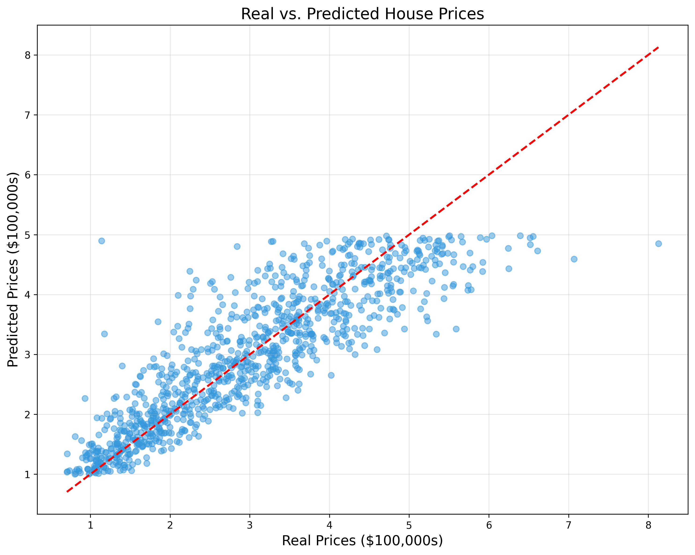

# House Price Predictor



## Overview

House Price Predictor is a web application that uses machine learning to estimate house prices in California based on various features such as location, house characteristics, and neighborhood information. The application provides an intuitive, user-friendly interface that allows users to input details about a house and receive an estimated price.

## Features

- **User-Friendly Interface**: Simple, intuitive design with clear instructions and form inputs
- **Dropdown Selections**: Easy-to-use dropdown menus instead of numeric inputs for better user experience
- **Interactive Visualizations**: Multiple visualization types to help understand the prediction model
- **Detailed Results**: Provides confidence levels and feature importance for each prediction
- **Responsive Design**: Works well on both desktop and mobile devices

## Visualizations

The application includes several data visualizations to help users understand the prediction model:

1. **Accuracy Visualization**: Shows how the model's predictions compare to actual house prices
2. **Feature Importance**: Displays which factors have the biggest impact on house prices
3. **Correlation Heatmap**: Shows how different features relate to each other
4. **Error Distribution**: Illustrates the distribution of prediction errors


## Installation

### Prerequisites

- Python 3.7+
- pip (Python package installer)

### Setup

1. Clone the repository:
   ```
   git clone https://github.com/yourusername/house-price-predictor.git
   cd house-price-predictor
   ```

2. Install the required packages:
   ```
   pip install -r requirements.txt
   ```

3. Run the application:
   ```
   python app.py
   ```

4. Open your web browser and navigate to:
   ```
   http://127.0.0.1:5000
   ```

## Usage

1. Fill in the form with details about the house:
   - Neighborhood income level
   - House age
   - Number of rooms and bedrooms
   - Population density
   - Household size
   - Location in California

2. Click the "Get Price Estimate" button

3. View your estimated house price along with:
   - Confidence level
   - Factors that influenced the price
   - Visualizations showing model performance


## Technical Details

### Machine Learning Model

The application uses a Linear Regression model trained on the California Housing dataset. The model takes the following features as input:

- Median Income (MedInc)
- House Age (HouseAge)
- Average Rooms (AveRooms)
- Average Bedrooms (AveBedrms)
- Population (Population)
- Average Occupancy (AveOccup)
- Latitude
- Longitude

### Data Preprocessing

- Features are scaled using StandardScaler
- The model is trained on historical California housing data
- Predictions are in units of $100,000s

### Visualization Generation

The application includes a script (`generate_visualizations.py`) that creates various visualizations to help understand the model:

- Real vs. Predicted scatter plot
- Feature importance bar chart
- Correlation heatmap
- Error distribution histogram


## Project Structure

```
house-price-predictor/
├── app.py                  # Flask application
├── house_model.pkl         # Trained machine learning model
├── scaler.pkl              # Feature scaler
├── generate_visualizations.py  # Script to generate visualizations
├── static/                 # Static files (CSS, images)
│   ├── real_vs_predicted.png
│   ├── feature_importance.png
│   ├── correlation_heatmap.png
│   └── error_distribution.png
├── templates/              # HTML templates
│   └── index.html          # Main application page
└── README.md               # Project documentation
```

## Future Improvements

- Add more advanced machine learning models (Random Forest, Gradient Boosting)
- Implement user accounts to save previous predictions
- Add comparison feature to compare multiple house price estimates
- Include more detailed location data (school districts, crime rates, etc.)
- Add time-series analysis to show price trends over time
- Implement interactive maps for location selection

## Credits

- California Housing dataset
- Flask web framework
- Scikit-learn for machine learning
- Pandas and NumPy for data processing
- Matplotlib and Seaborn for visualizations
- Bootstrap for frontend styling

